# CST8912 — Graded Lab Activity 1

**Lab title:** Provisioning and Managing an Azure Virtual Machine  
**Name:** Samuel Vachon  
**Student number:** 041101891  
**Section:** CST8912_013  
**Date:** October 4, 2026

## Objective

Deploy an Ubuntu virtual machine in Azure, manage its power state, configure monitoring, connect through SSH, and delete the dedicated lab resource group after collecting evidence.

## Configuration Summary

| Setting                      | Configuration                                                                                             |
| ---------------------------- | --------------------------------------------------------------------------------------------------------- |
| Subscription                 | Lab subscription named MOC DS - 10290                                                                     |
| Resource group               | CST8912-Lab1-041101891                                                                                    |
| VM name                      | cst8912-vm-sv                                                                                             |
| Region                       | Canada Central                                                                                            |
| Operating system             | Ubuntu 24.04                                                                                              |
| Architecture / generation    | x64 / V2                                                                                                  |
| VM size                      | Standard_B2s — 2 vCPUs and 4 GiB RAM                                                                      |
| Availability                 | Availability zone 1                                                                                       |
| Security type                | Not captured before cleanup                                                                               |
| Authentication               | SSH public key                                                                                            |
| Administrator username       | azureuser                                                                                                 |
| OS disk type                 | Standard SSD LRS                                                                                          |
| OS disk provisioned size     | Not captured before cleanup; Linux reported a 29G root filesystem                                         |
| Virtual network              | vnet-canadacentral-1                                                                                      |
| Subnet                       | snet-canadacentral-1                                                                                      |
| Network interface            | cst8912-vm-sv901                                                                                          |
| SSH access                   | Public IP connection using TCP port 22                                                                    |
| Boot diagnostics             | Setting not captured before cleanup                                                                       |
| Log Analytics workspace      | cst8912-law-sv                                                                                            |
| Workspace region             | Canada Central                                                                                            |
| Workspace pricing tier       | Pay-as-you-go                                                                                             |
| Classic log-based monitoring | Enabled                                                                                                   |
| OpenTelemetry metrics        | Enabled                                                                                                   |
| Azure Monitor workspace      | defaultazuremonitorworkspace-cca                                                                          |
| Data collection rule         | msvmi-canadacentral-cst8912-vm-sv                                                                         |
| Agent installation evidence  | Monitoring data was received; a separate Azure Monitor Agent extension-status screenshot was not captured |

## Variations and Issues

I used Standard_B2s instead of the suggested Standard_B1s. The deployed VM had 2 vCPUs and 4 GiB of memory. I also used Standard SSD LRS instead of Premium SSD LRS, which is an alternative permitted by the lab instructions. The VM was deployed in availability zone 1 rather than using the suggested no-redundancy option. The exact restriction messages and any approval for the alternative VM size were not captured in the evidence.

The portal displayed Insights as “Insights (now Monitor).” Monitoring configuration enabled both classic log-based metrics using my Log Analytics workspace and OpenTelemetry metrics using an Azure Monitor workspace.

My first SSH connection closed before login. I accidentally ran uname -a in Windows PowerShell, where the command was not recognized. I connected again successfully and ran the Linux commands inside the VM.

## Task 1 — Create the Resource Group

I created the dedicated resource group CST8912-Lab1-041101891. I used this group to organize the VM and its related lab resources so they could be removed together after completing the activity.

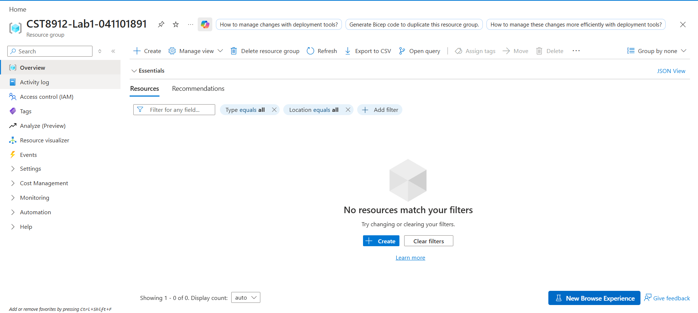

## Tasks 2–5 — Configure and Deploy the VM

I deployed cst8912-vm-sv in Canada Central using Ubuntu 24.04 and the Standard_B2s size. The VM used SSH key authentication with the administrator username azureuser.

The deployment completed successfully. The VM Overview showed its Running status, availability zone, operating system, size, public IP, and virtual network connection.

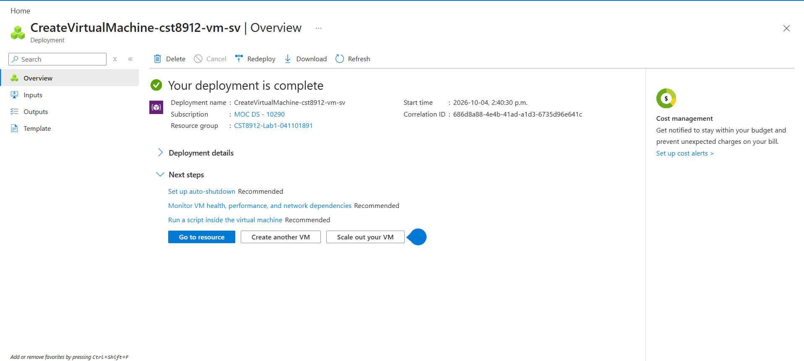

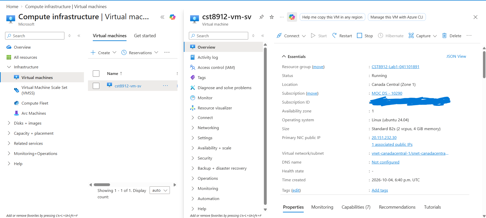

## Task 6 — Manage the VM Power State

I stopped, started, and restarted the VM through Azure Portal.

| Operation                 | Observed result               |
| ------------------------- | ----------------------------- |
| Initial deployment        | Running                       |
| Stop through Azure Portal | Stopped (deallocated)         |
| Start                     | Running                       |
| Restart                   | Succeeded in the Activity log |

The Activity log also showed successful Start Virtual Machine and Deallocate Virtual Machine operations.

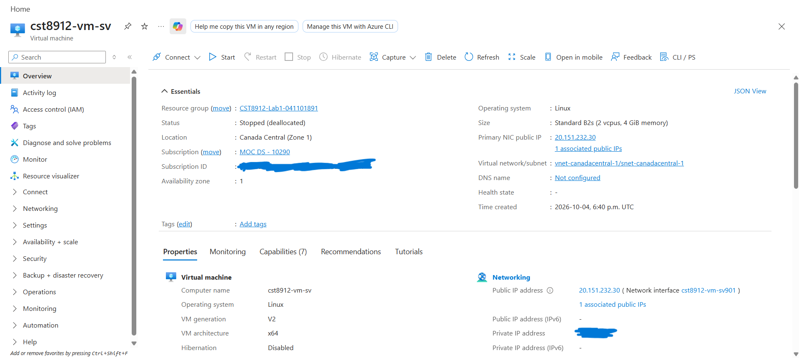

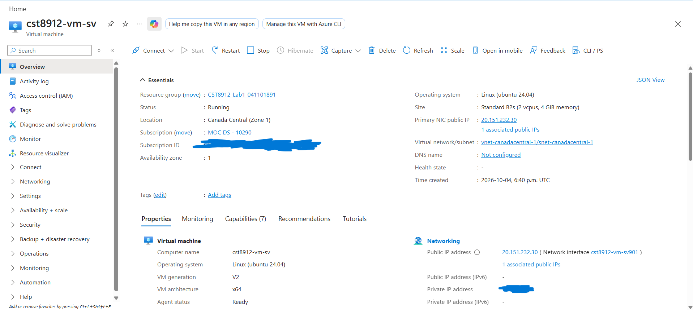

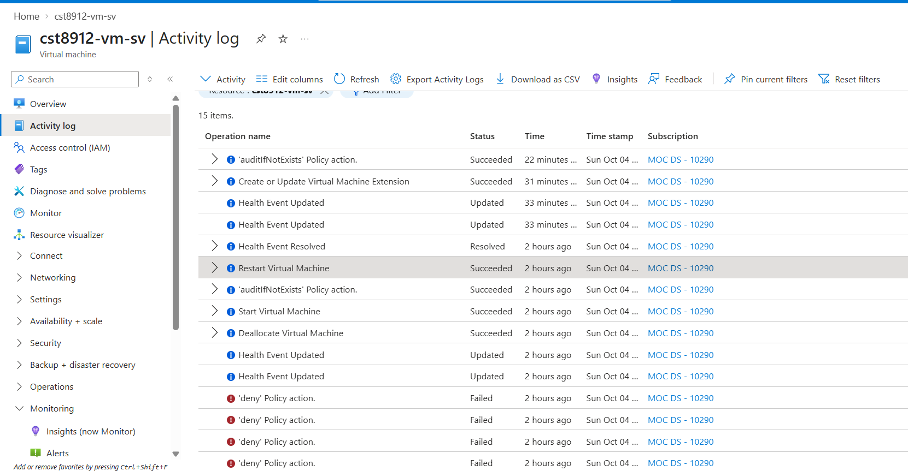

Stopping through Azure Portal deallocates compute resources. Shutting down only inside Linux may leave the VM allocated. Supporting resources, including managed disks and monitoring data, can still incur charges after compute is deallocated.

## Task 7 — Create a Log Analytics Workspace

I created cst8912-law-sv in the dedicated lab resource group. The workspace was located in Canada Central and used the Pay-as-you-go pricing tier. Its Overview showed an Active status and no reported operational issues.

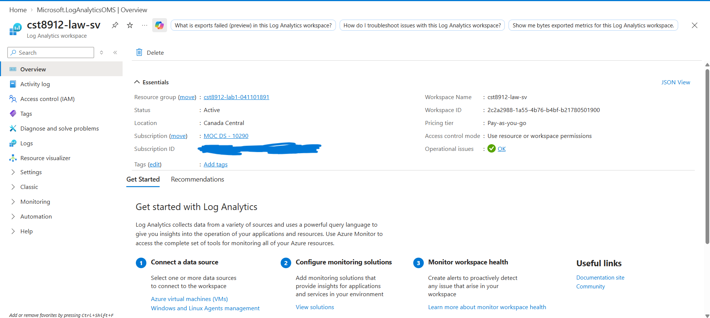

## Task 8 — Enable VM Monitoring

I configured monitoring through the VM’s Monitor page. Monitor Settings confirmed that classic log-based metrics were enabled with cst8912-law-sv as the Log Analytics workspace.

The associated data collection rule was msvmi-canadacentral-cst8912-vm-sv, located in Canada Central. OpenTelemetry metrics were also enabled with defaultazuremonitorworkspace-cca as the Azure Monitor workspace.

After onboarding completed and data began arriving, the charts displayed availability, CPU utilization, and memory utilization. The captured chart summaries showed maximum values of 1.77% CPU utilization and 16.69% memory utilization, with an availability value of 1.

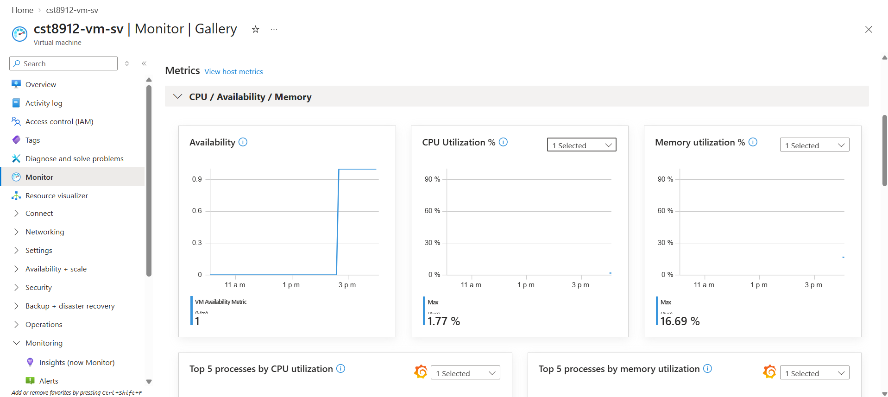

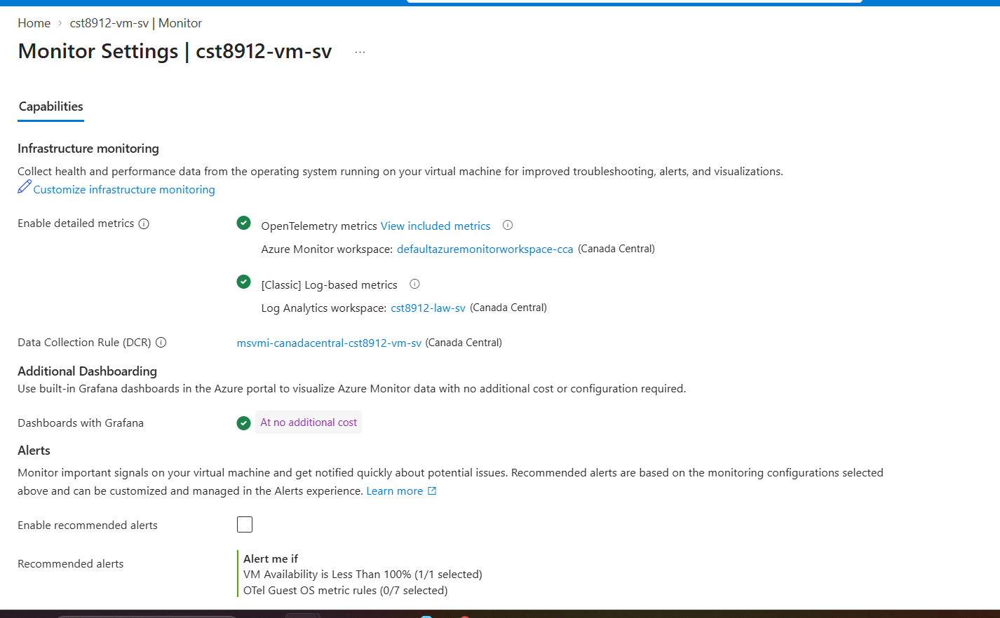

## Task 9 — Connect Through SSH

I connected from Windows PowerShell using the private key stored in my .ssh folder. The public IP is replaced with a placeholder in this report.

```powershell
ssh -i "C:\Users\samue\.ssh\cst8912-key-sv.pem" azureuser@YOUR-VM-PUBLIC-IP
```

After connecting successfully as azureuser, I ran:

```bash
uname -a
top
```

After pressing q to exit top, I ran:

```bash
uname -a
df -h
mkdir -p ~/lab1-check
echo "CST8912 Lab 1" > ~/lab1-check/verification.txt
ls -l ~/lab1-check
cat ~/lab1-check/verification.txt
```

### Command Purposes

| Command                      | Purpose                                                   |
| ---------------------------- | --------------------------------------------------------- |
| uname -a                     | Displays Linux kernel and system information.             |
| top                          | Displays running processes, CPU activity, and memory use. |
| df -h                        | Displays filesystem capacity and usage.                   |
| mkdir -p                     | Creates the verification directory.                       |
| echo with output redirection | Writes the required text to verification.txt.             |
| ls -l                        | Displays the file listing and metadata.                   |
| cat                          | Displays the verification file contents.                  |
| exit                         | Closes an SSH session.                                    |

### Observed Results

The uname -a output identified the VM as an x86_64 Linux system using the Ubuntu Azure kernel 6.17.0-1022-azure.

The top output showed 130 tasks, approximately 3862 MiB of total memory, and 99.5% idle CPU at the captured moment.

The df -h output showed a root filesystem of 29G, with 2.6G used, 26G available, and 10% usage. These are filesystem values rather than confirmation of the managed disk’s provisioned capacity.

The verification.txt file was created successfully. The file listing showed that it belonged to azureuser, and cat displayed the required text:

```text
CST8912 Lab 1
```

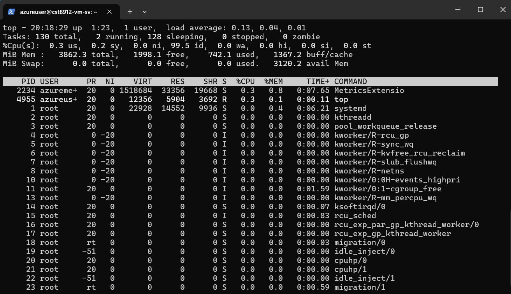

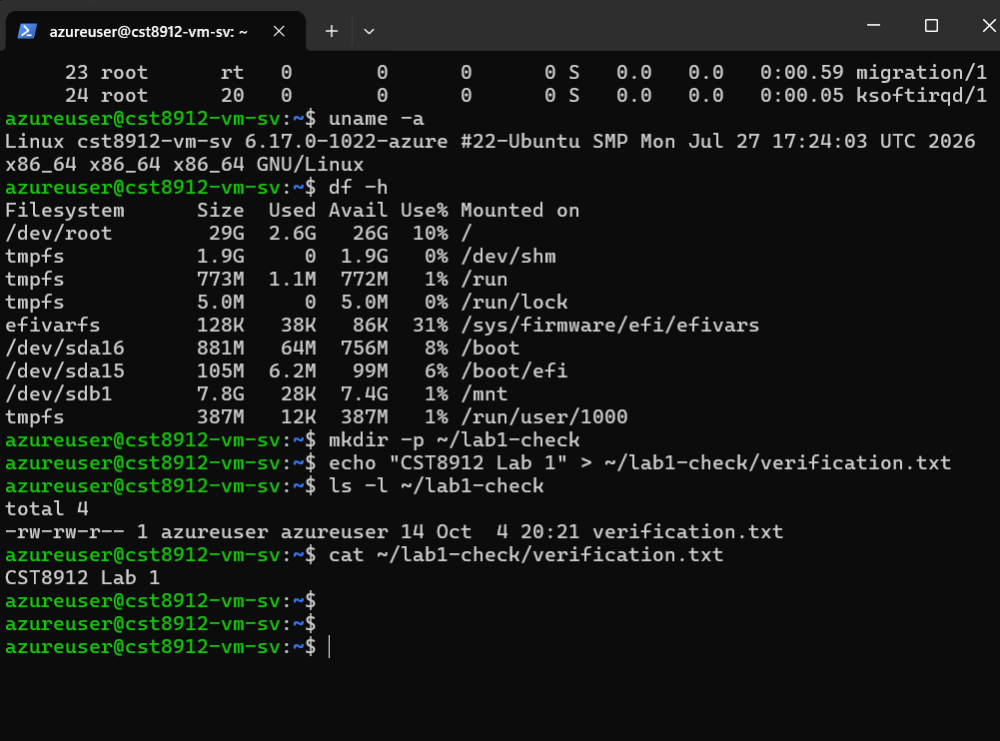

## Task 10 — Delete the Lab Resources

After collecting the evidence, I deleted CST8912-Lab1-041101891. Azure Portal displayed a successful deletion notification, and the subsequent Resource groups list no longer included the dedicated lab group.

The default Azure Monitor workspace and its supporting resources were outside the dedicated group. I left them intact because the lab’s cleanup instructions specified deleting only the dedicated Lab 1 resource group, and their exclusive ownership was not established.

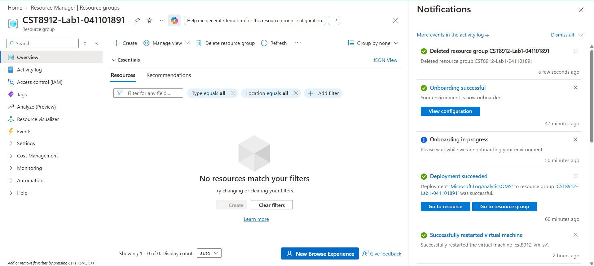

## Architecture Explanation

The VM provides the virtual CPU and memory used to run Ubuntu. Its managed OS disk stores the operating system and files, including verification.txt.

The network interface connects the VM to a subnet within the virtual network. The public IP provides an address reachable by the local SSH client. The network security group controls allowed network traffic, while SSH key authentication verifies the connecting user. The lab requires inbound SSH access on TCP port 22.

The Azure Monitor Agent is the guest monitoring component used by the lab workflow. It collects data according to an associated data collection rule. The DCR defines the data collected and its destinations.

My monitoring settings showed two enabled paths: classic log-based metrics sent to the Log Analytics workspace and OpenTelemetry metrics associated with the Azure Monitor workspace. The portal displayed the collected performance information in monitoring charts.

Boot diagnostics provides startup troubleshooting information separately from guest performance monitoring.

### IaaS Responsibilities

An Azure VM is Infrastructure as a Service (IaaS). Azure manages the physical infrastructure, while the customer manages the guest operating system, installed software, updates, credentials, network access configuration, and monitoring settings.

Platform as a Service (PaaS), such as Azure App Service, also manages the operating-system platform. Software as a Service (SaaS), such as Microsoft 365, provides a complete application for users.

Although my VM was placed in availability zone 1, a single VM does not provide an application failover solution. This lab did not implement multiple instances, load balancing, or automatic scaling.

## Reflection

### Compute

Stopping, starting, and restarting the VM helped me understand how Azure manages compute resources. The portal displayed Stopped (deallocated) after stopping and Running after starting. The Activity log provided evidence that the operations succeeded. The top command showed that the VM had low CPU activity during my inspection.

### Storage

The root filesystem had 2.6G used and 26G available. Creating and reading verification.txt demonstrated that I could store and access files inside the VM. I also learned that filesystem capacity and managed disk provisioned capacity are different measurements.

### Networking

The public IP and SSH connection allowed me to access the VM from my computer. The SSH key authenticated the connection as azureuser. When the first connection closed, I learned to check whether I was at the Windows PowerShell prompt or the Linux VM prompt before running commands.

### Monitoring

The monitoring charts displayed CPU, memory, and availability data. The captured maximum CPU utilization was 1.77%, and maximum memory utilization was 16.69%. Monitor Settings helped me understand how the DCR and workspace destinations relate to the collected data.

### Cost Control and Cleanup

I used a burstable Standard_B2s VM and Standard SSD LRS storage. Deallocating the VM stopped compute allocation, but supporting resources could still incur charges. Deleting the dedicated resource group removed its contained lab resources.

The additional monitoring workspace showed why it is important to check resource locations and ownership during cleanup. I followed the lab’s dedicated-group cleanup scope and left resources outside that group intact.

## Evidence Limitations

The screenshots confirm deployment, power operations, monitoring configuration, performance data, Linux commands, file verification, and dedicated resource-group deletion.

The managed disk’s provisioned size, security type, boot diagnostics setting, and separate Azure Monitor Agent extension status were not captured before cleanup. These details are not presented as verified configuration values.
